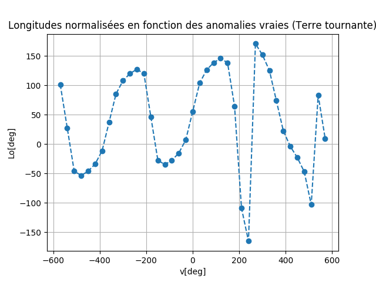
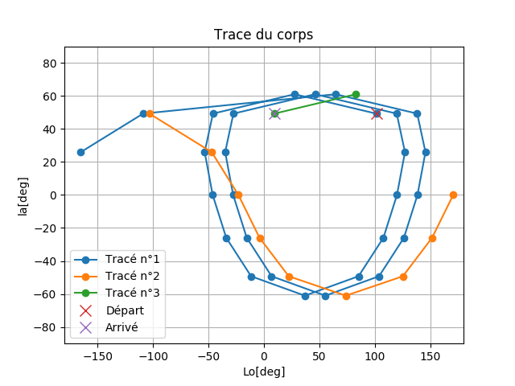

# Orbital Sp423

Petit programme pour calculer les différents paramètres orbitaux d'un objet en orbite autour d'un corps.

## Dépendences
- Python 3.6+
- Numpy
- Matplotlib

## Précisions
Sur le graphique intitulé *Longitudes normalisées en fonction des anomalies vraies (Terre tournante)*, les sauts
sur les ordonnés sont dûs à l'ajustement parce que les longitudes dépassent les ±180.

Sur le graphique intitulé *Trace du corps* vous pourrez avoir plusieurs traces, intitulées
*Tracé n°`i`*. Ces différentes traces sont dues au dépassement des longitudes. Partez du point de départ et suivez les 
traces dans le bon ordre jusqu'au point d'arrivé.

